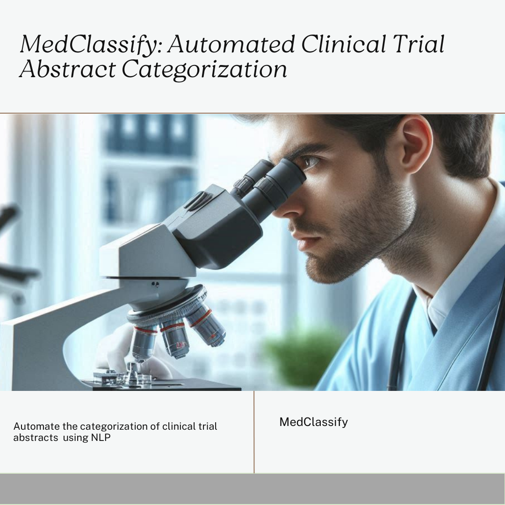
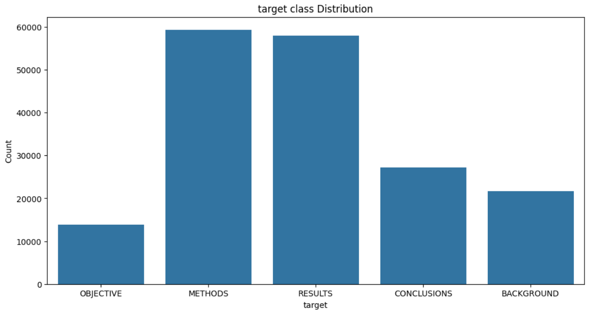
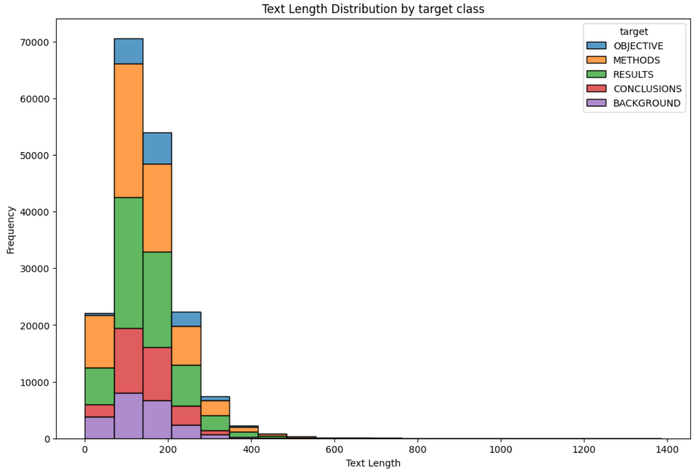
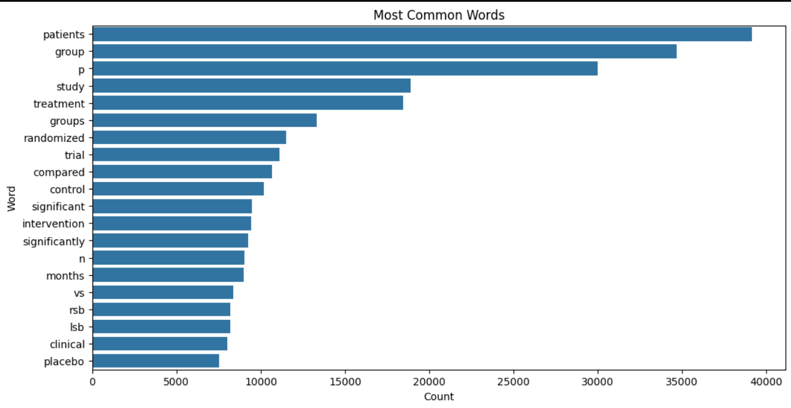
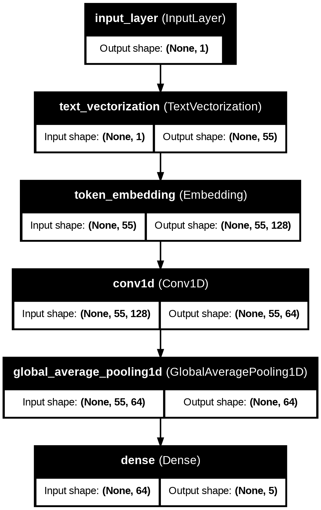
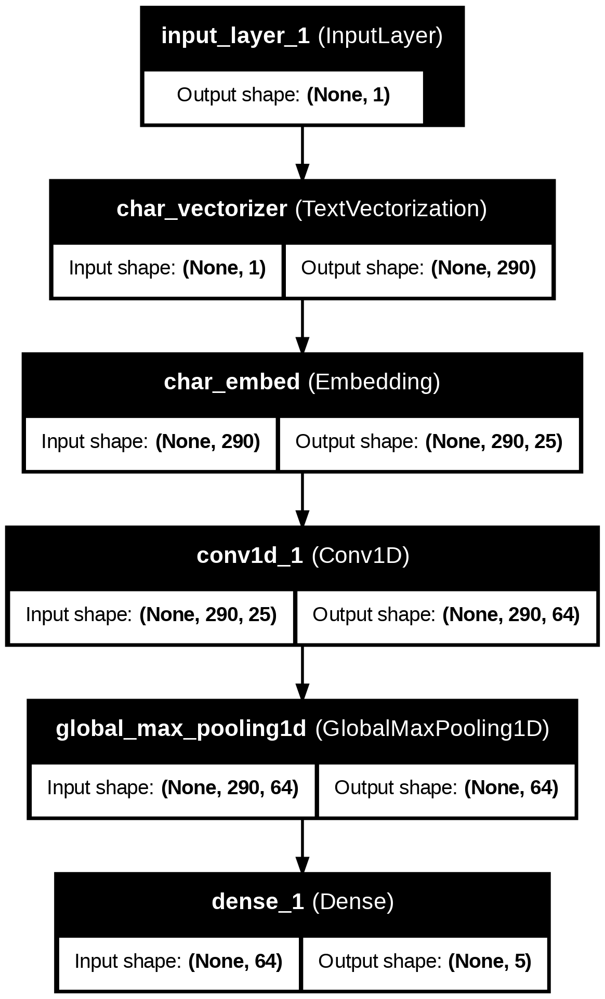
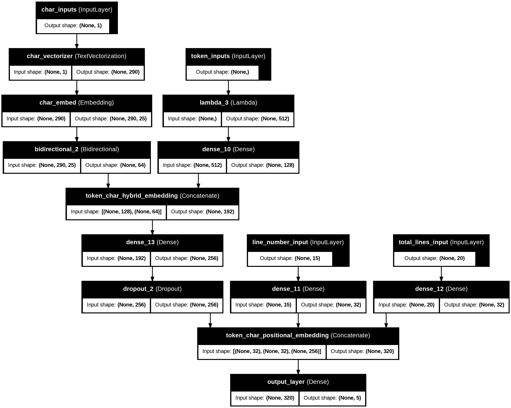
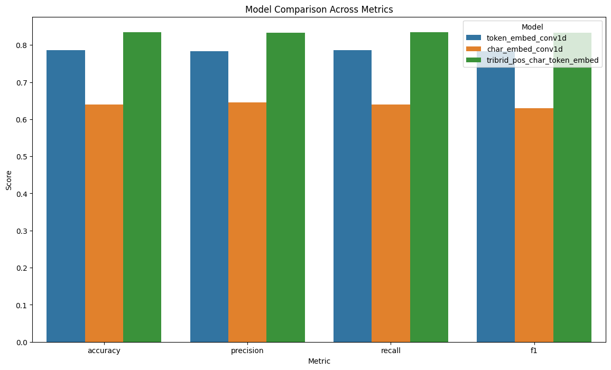
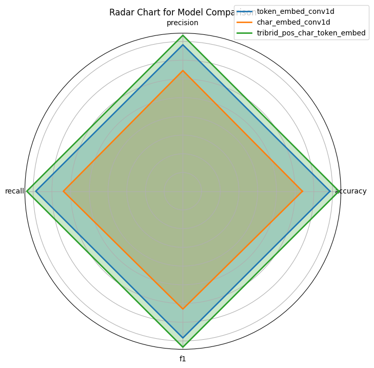

# MedClassify: Automated Clinical Trial Abstract Categorization

MedClassify is a data science project designed to automate the categorization of clinical trial abstracts using advanced natural language processing (NLP) techniques. The project utilizes the PubMed 200k RCT dataset to build a model capable of classifying abstracts into predefined sections like Background, Objective, Methods, Results, and Conclusions. This project demonstrates the end-to-end process of developing a machine learning model, from data exploration to deployment.

## Objectives

- Develop an NLP model that can classify sentences in research abstracts into specific roles such as objective, methods, results, and conclusions.

- The project seeks to explore and implement various deep learning models to achieve high accuracy in sentence classification. This includes experimenting with different architectures and embeddings, such as Conv1D models and multiple embeddings, to improve performance.

## Dataset

Data used available publically and for free  on this [github](https://github.com/Franck-Dernoncourt/pubmed-rct.git) page.

As per readme file:
- PubMed 20k is a subset of PubMed 200k. I.e., any abstract present in PubMed 20k is also present in PubMed 200k.

In this project we use PubMed_20k_RCT_numbers_replaced_with_at_sign  dataset.

It contains:
- dev.txt  
- test.txt  
- train.txt

## Data Exploration

Gain insights into the dataset through exploratory data analysis (EDA).

**Target class distribution**

The distribution appears to be imbalanced, with some classes having significantly higher counts than others. This class imbalance might impact the model's performance and requires careful consideration during training and evaluation.

**Text length distribution by target class**

The plot reveals distinct text length distributions for each target class. Some classes might exhibit a preference for shorter or longer texts. 'total lines' and 'line numbers' are feature engineered.

**Most common words in the input text**

  Bar chart illustrating the frequency of the most common words within a given text corpus. Words like "patients," "group," "study," and "treatment" have significantly higher frequencies, indicating a potential focus on medical or clinical research within the text data.
  
## Conv1D with token embeddings (Model 1)

{'accuracy': 78.63100754667019,
 'precision': 0.7825800470671647,
 'recall': 0.786310075466702,
 'f1': 0.783878513978757}
## Conv1D with character embeddings (Model 2)

{'accuracy': 63.89845094664371,
 'precision': 0.6446642098878304,
 'recall': 0.6389845094664371,
 'f1': 0.6295446380028339}

## tribrid embedding (Model 3)

## Model Comparison

**model Comparison across metrics**

**model Comparison (Radar chart)**

